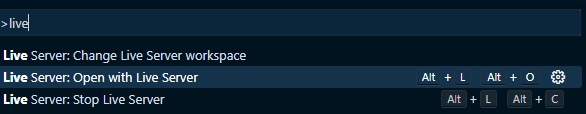

# handwrite-js

## できること
- 手書きがブラウザでできる
- 1画ずつ消せる
- 全部一括で削除できる
- ペンとマーカーを切り替えれる

## 仕様ライブラリ
[fabric.js](http://fabricjs.com/)

## 参考リンク
[Fabric.jsでお絵かきアプリをつくる FROM Qiita](https://qiita.com/citrus_candy/items/3d8af7e1abf0ee994b3d)

## VSCODEでの実行方法

> VSCODEのInstallの手順は省略します

### Installする拡張機能

- 名前: Live Server
- ID: ritwickdey.LiveServer
- VS Marketplace リンク: https://marketplace.visualstudio.com/items?itemName=ritwickdey.LiveServer

### 実行方法
1. 拡張機能をInstallした状態で`Ctrl+Shift＋P`を押下して「live」と入力
2. `LiveServer:Open with Live Server`を選択し、ローカルサーバーを起動する

3. ブラウザが立ち上がるのでそこで確認
